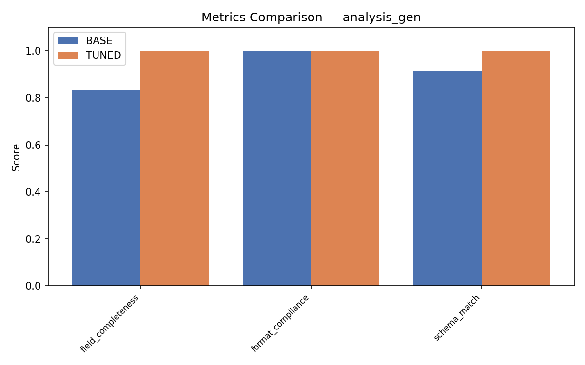
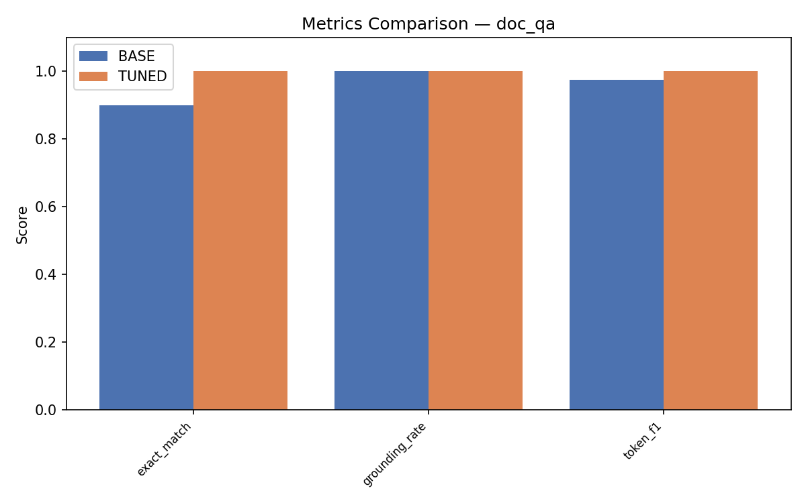
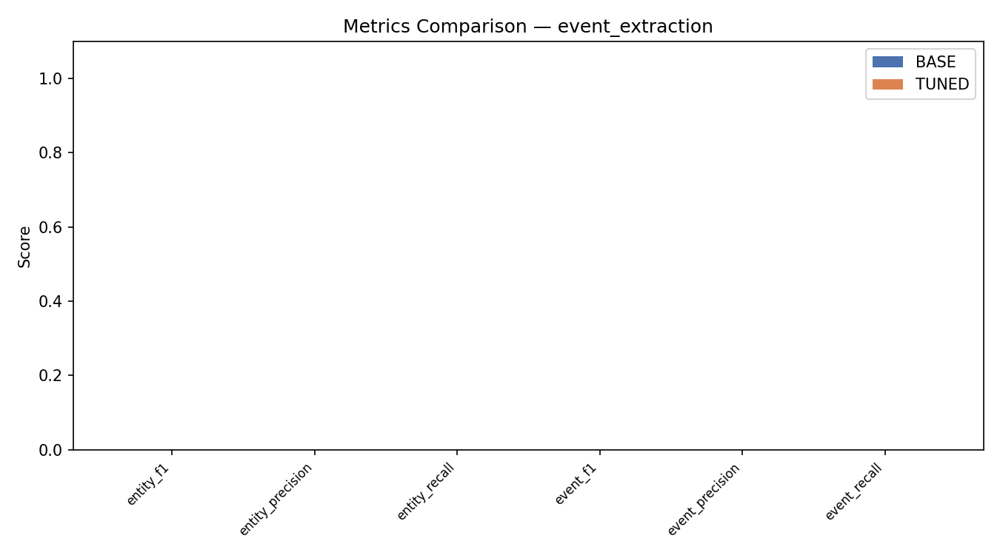
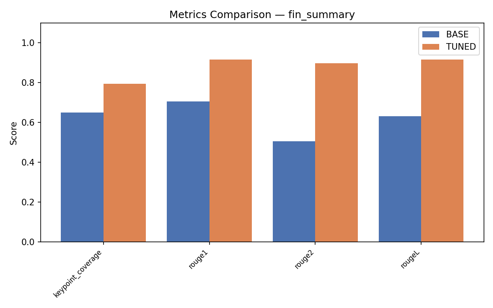
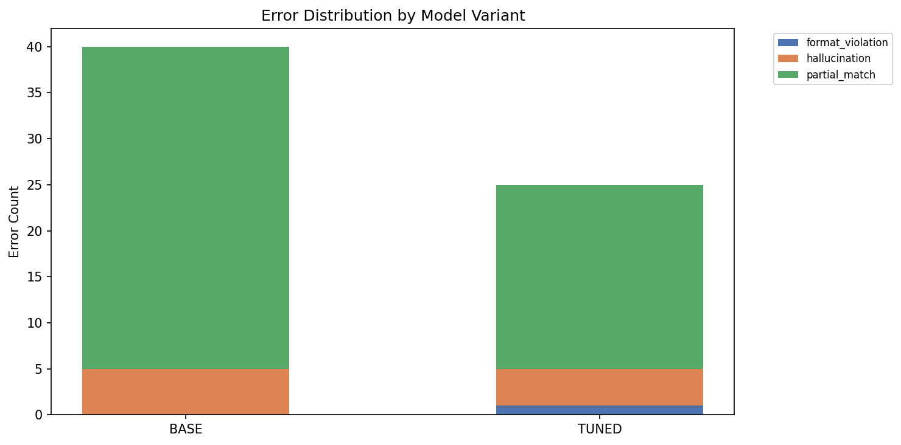
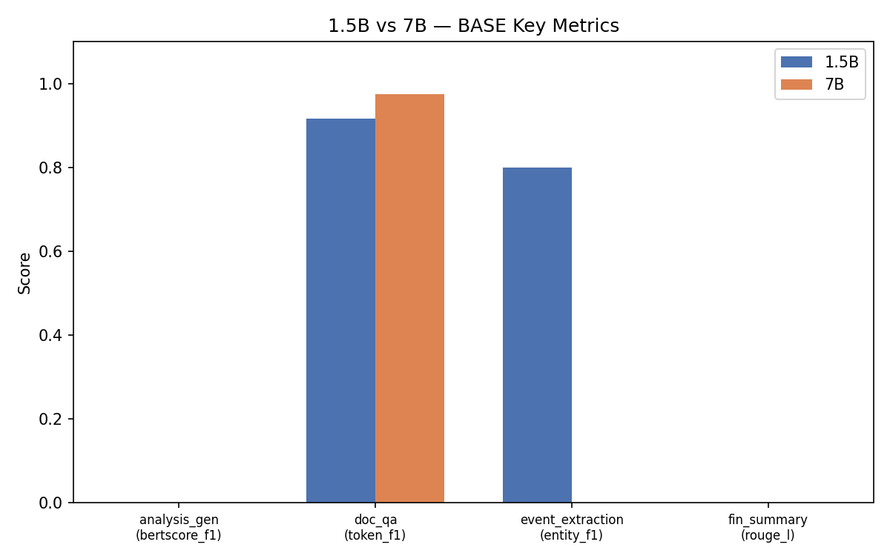
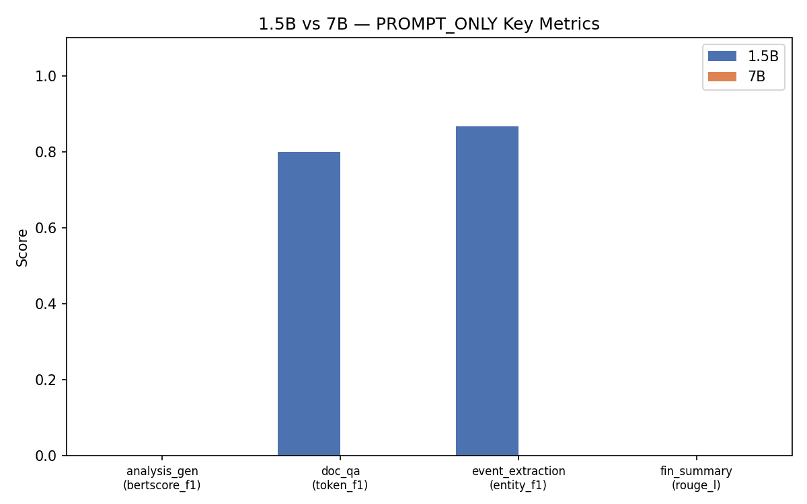
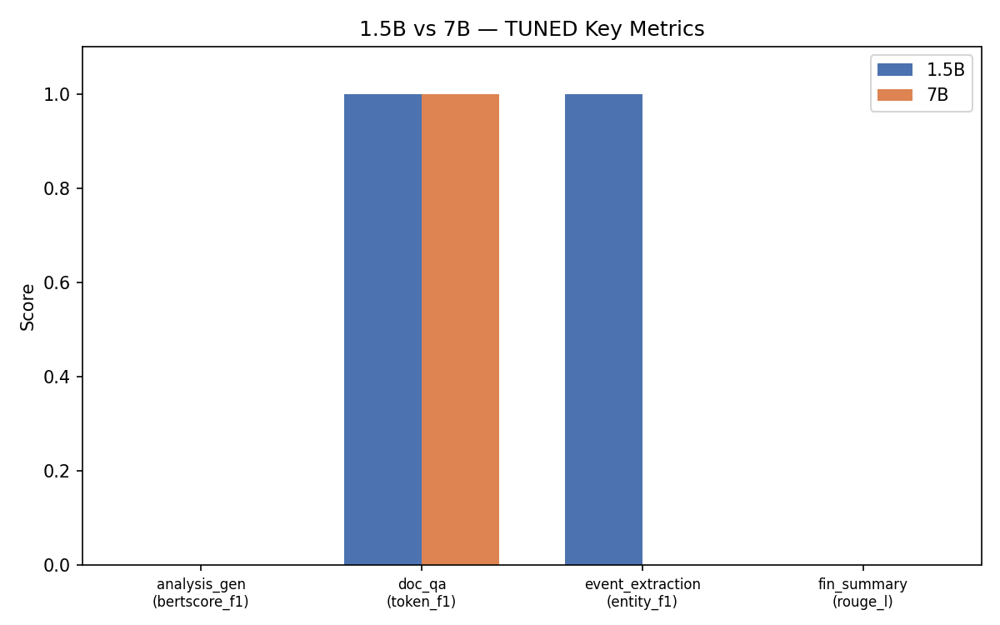

# Domain LLM Studio — Comprehensive Evaluation Report

*Generated: 2026-04-03 12:23:11*

## Qwen2.5-1.5B Results

### analysis_gen

| Metric | BASE | PROMPT_ONLY | TUNED |
|--------|--------|--------|--------|
| field_completeness | 0.5000 | 0.7000 | 1.0000 |
| format_compliance | 1.0000 | 1.0000 | 1.0000 |
| schema_match | 0.7500 | 0.8500 | 1.0000 |

### doc_qa

| Metric | BASE | PROMPT_ONLY | TUNED |
|--------|--------|--------|--------|
| exact_match | 0.8000 | 0.8000 | 1.0000 |
| grounding_rate | 0.8000 | 0.8000 | 1.0000 |
| token_f1 | 0.9167 | 0.8000 | 1.0000 |

### event_extraction

| Metric | BASE | PROMPT_ONLY | TUNED |
|--------|--------|--------|--------|
| entity_f1 | 0.8000 | 0.8667 | 1.0000 |
| entity_match_rate | 0.9000 | 1.0000 | 1.0000 |
| entity_precision | 0.7500 | 0.8000 | 1.0000 |
| entity_recall | 0.9000 | 1.0000 | 1.0000 |
| event_f1 | 0.1667 | 0.1667 | 0.6000 |
| event_precision | 0.1500 | 0.1500 | 0.6000 |
| event_recall | 0.2000 | 0.2000 | 0.6000 |
| key_presence_rate | 1.0000 | 1.0000 | 1.0000 |
| parse_failure_rate | 0.0000 | 0.0000 | 0.0000 |
| partial_field_match | 0.7167 | 0.6333 | 0.9333 |

### fin_summary

| Metric | BASE | PROMPT_ONLY | TUNED |
|--------|--------|--------|--------|
| keypoint_coverage | 0.5452 | 0.5120 | 0.8145 |
| rouge1 | 0.6582 | 0.6670 | 0.9276 |
| rouge2 | 0.4747 | 0.4323 | 0.9139 |
| rougeL | 0.5982 | 0.6284 | 0.9248 |

## Qwen2.5-7B Results

### analysis_gen

| Metric | BASE | TUNED |
|--------|--------|--------|
| field_completeness | 0.8333 | 1.0000 |
| format_compliance | 1.0000 | 1.0000 |
| schema_match | 0.9167 | 1.0000 |

### doc_qa

| Metric | BASE | TUNED |
|--------|--------|--------|
| exact_match | 0.9000 | 1.0000 |
| grounding_rate | 1.0000 | 1.0000 |
| token_f1 | 0.9750 | 1.0000 |

### event_extraction

| Metric | BASE | TUNED |
|--------|--------|--------|
| entity_f1 | 0.0000 | 0.0000 |
| entity_precision | 0.0000 | 0.0000 |
| entity_recall | 0.0000 | 0.0000 |
| event_f1 | 0.0000 | 0.0000 |
| event_precision | 0.0000 | 0.0000 |
| event_recall | 0.0000 | 0.0000 |
| parse_failure_rate | 0.0000 | 0.0000 |

### fin_summary

| Metric | BASE | TUNED |
|--------|--------|--------|
| keypoint_coverage | 0.6499 | 0.7952 |
| rouge1 | 0.7061 | 0.9161 |
| rouge2 | 0.5066 | 0.8984 |
| rougeL | 0.6328 | 0.9161 |

## External Benchmark: FinanceBench

### BASE

| Metric | Value |
|--------|-------|
| exact_match | 0.0000 |
| grounding_rate | 0.1250 |
| token_f1 | 0.0619 |

### PROMPT_ONLY

| Metric | Value |
|--------|-------|
| exact_match | 0.0000 |
| grounding_rate | 0.3750 |
| token_f1 | 0.0861 |

### TUNED

| Metric | Value |
|--------|-------|
| exact_match | 0.0000 |
| grounding_rate | 0.2500 |
| token_f1 | 0.1585 |

## Charts

